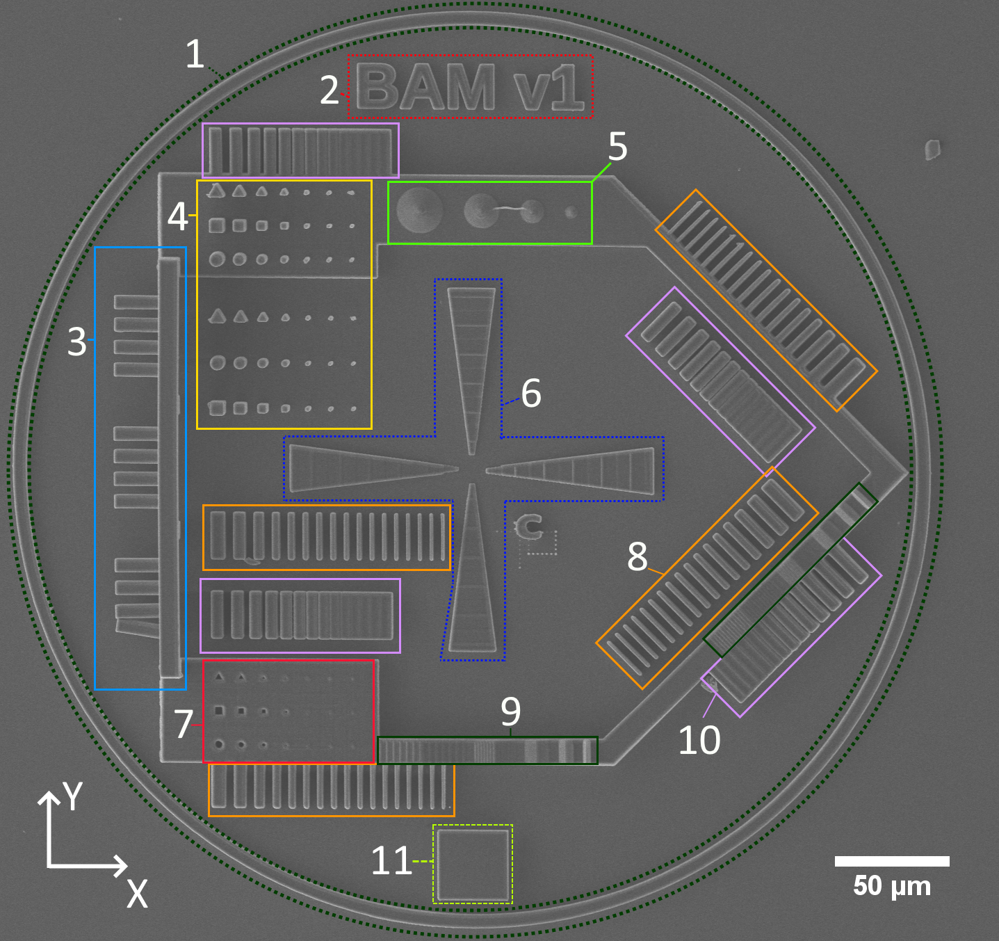

# 2PP-TestArtifact
Contains a 2PP-test artifact

This repository contains a test artifact (TA) or test structure designed for two-photon polymerization (also known as Direct Laser Writing (DLW) or Two/Multi-photon lithography (2PA/MPA)).
Test artifacts can be used to compare structures, to check options used by the slicer, check the state of the 2PP machine itself or to get an construction guidelines.

General ideas behind the test artifact:

* optimized for 2PP-DLW
* should be fast and easy to analyse, preferably with optical microscopy or non-tilted scanning electron microscopy
* short time to fabricate
* include a reasonable amount of different features
* bulk and small structures on the substrate

## Features of the test artifact

The following features are integrated in the current version of the test artifact.

| Feature Type | Name |Usage |
| :----: | :-------------: |------------- |
| 1  | Outer Ring  |Tilt analysis, Stitching artefacts |
| 2  | Version Indicator  |    |
| 3  | Z spacing  | estimation of free space in Z direction |
| 4  | Rods | reproducability of geometric shapes |
| 5  | Cones  | shutter properties |
| 6  | Immersion indicator  | immersion depzh of TA  |
| 7  | Holes  | reproducability of geometric shapes |
| 8  | Thin Walls  | reproducability of geometric shapes  |
| 9  | Staircase Control  | staircase effect in different angles |
| 10  | Gaps  | reproducability of geometric shapes |
| 11  | Test Pad  |  analyse chemical, mechanical or structural properties |

## How to cite?

This work is currently available as pre-print here:

Please cite this work as:

## Further ideas for optimization:

* independent individual features so they can be fabricated alone
